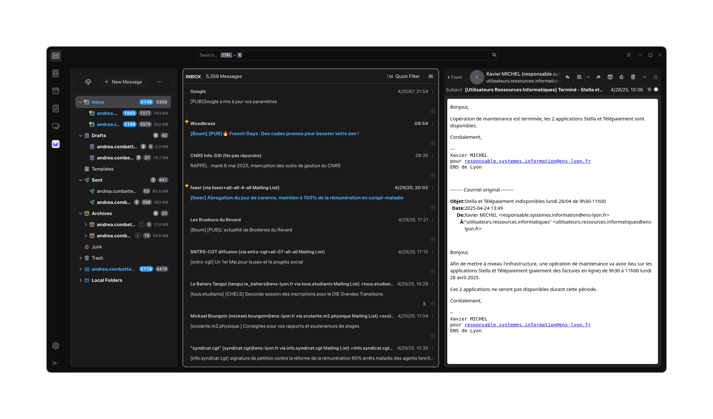

# Thunderbird Modern Minimal Theme

This repository contains a more modern and minimal Thunderbird theme designed for a clean look and feel. It customizes various UI elements such as toolbars, tabs, panes, and inputs.

<div align="center">
  
</div>

## Recommended Extension

I recommend installing [CompactHeaders](https://addons.thunderbird.net/en-US/thunderbird/addon/compact-headers/) to further reduce header clutter and maintain the minimal aesthetic.

1. Open Thunderbird and go to **Tools > Add‑ons and Themes**.
2. Search for **CompactHeaders**.
3. Click **Add to Thunderbird** and restart the application.

## Installation

1. Locate your Thunderbird profile folder
  - In Thunderbird, go to **Help > Troubleshooting Information**.
  - Click **Open Direct** next to **Profile Folder**.

2. Create (or open) the `chrome` directory
  - If a `chrome` folder does not exist in your profile, create it now.

3. Copy or clone this repository into `chrome`
  - Using Git:
    ```bash
    cd /path/to/your/profile
    git clone https://github.com/yourusername/thunderbird-modern-minimal-theme.git chrome/
    ```
  - Or download the ZIP from GitHub and extract its contents into `chrome/modern-minimal-theme`.

4. Enable custom stylesheets
  - In Thunderbird’s address bar, type `about:config` and press Enter.
  - Search for `toolkit.legacyUserProfileCustomizations.stylesheets` and set it to `true`.

5. Restart Thunderbird
  - Quit Thunderbird completely and reopen it.

6. Verify the theme
  - If you don’t see the new style, double‑check that all files are in `.../profile/chrome/` and that the preference is enabled.

## File Structure
- ./config/
  - colors.css — Holds color variables for the theme.
  - variables.css — Stores global spacing, sizing, and font variables.
- ./css/
  - toolbars.css, tabs.css, panes.css, inputs.css — Styles for each Thunderbird UI component.
- userChrome.css — Main entry importing component styles for Thunderbird’s interface.
- userContent.css — Additional styling rules that apply to message content.

## Contributing
Feel free to open an issue or submit a pull request. All contributions are welcome.

## License
This project is licensed under the MIT License – see the [LICENSE](./LICENSE) file for details.
